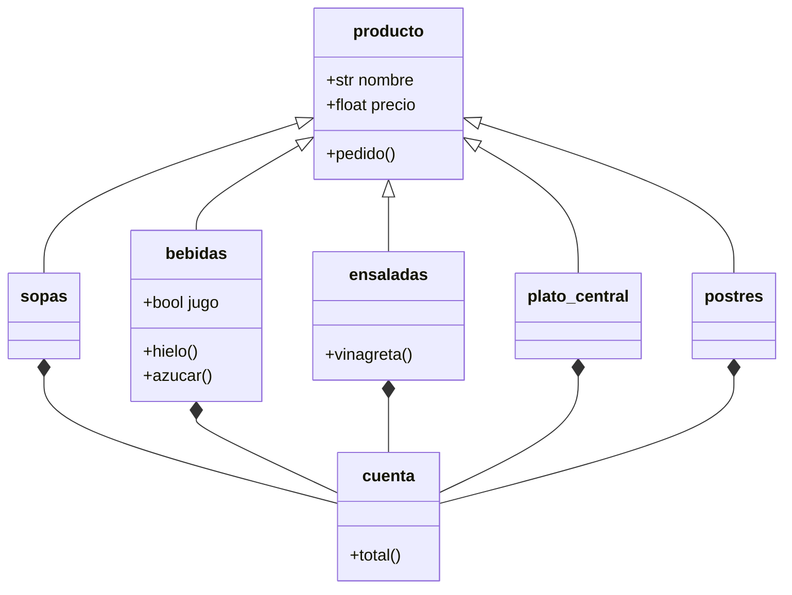

# Reto_3_poo

----------------------------------
### Ejercicio: Cree la clase Linea y redefina la clase rectangulo a partir de 2 lineas
```python
class Point: #definimos el punto por dos coordenadas en el plano
  def __init__(self, x: float, y: float): 
    self.x = x
    self.y = y
  def redo(self,nx,ny):
    self.x = nx
    self.y = ny
class Line:
   def __init__(self, ps:Point, pe:Point): #definimos un segmento de recta con 2 puntos
      self.start = ps
      self.end = pe
      if (self.start.y == self.end.y):
         q ="recta horizontal"
      elif (self.start.x == self.end.x):
         q ="recta vertical"
      else:
         q = (self.start.y - self.end.y)/(self.start.x - self.end.x)
      self.slope= q #definimos la pendiente de la recta a la cual pertenece el segmento
   def lenght(self):
      return ((self.end.x - self.start.x)**2 + (self.end.y - self.start.y)**2)**0.5 
   def function(self,x:float)->float:
      if self.slope == "recta horizontal":
         if self.start.y == 0:
            return "horizontal en el origen"
         else: 
            return "horizontal fuera del origen"
      if self.slope == "recta vertical":
         if self.start.x == 0:
            return "vertical en el origen"
         else: 
            return "vertical fuera del origen"
      b= self.start.y - ((self.slope)*(self.start.x))
      f=self.slope*x + b #definimos los componentes para formar la ecuacion de la recta
      return f
   def vertical_cross(self):
      if self.function(self.start.x) == "vertical en el origen":
            print("interseca con el eje y en toda su longitud ")
      elif self.function(self.start.x) == "vertical fuera del origen":
          print( "la recta vertical no interseca con el eje y")
      else:
         for i in range (self.start.x, self.end.x):
            if self.function(i) == self.function(0):
             print("interseca con y en: ")
             return i
            else:
               print("no interseca con y")
   def horizontal_cross(self):
      if self.function(self.start.y) == "horizontal en el origen":
            print("interseca con el eje x en toda su longitud ")
      elif self.function(self.start.y) == "horizontal fuera del origen":
          print( "la recta horizontal no interseca con el eje x")
      else:
         n=False
         for i in range (self.start.y, self.end.y):
            if i==0:
               n=True
               f=i
         if n==True:
            print("interseca con x en: ")
            return f
         else:
            print("no interseca con x")
   def discretizador(self,n):
      i:float=self.start.x
      l:list=[]
      while i<=self.end.x:
         if self.slope == "recta horizontal":
            l.append(Point(i,self.function(i)))
         elif self.slope == "recta vertical":
            l.append(Point(self.start.x,i))
         else:
            l.append(Point(i, self.function(i)))
         i= i + n  
      return l    
class Rectangle:
   def __init__(self, lh: Line, lv: Line): #definimos el rectangulo con su linea horizontal superior y linea vertical izquierda
      if lh.slope != "recta horizontal":
         raise ValueError("la linea horizontal ingresada no es horizontal, ingrese una linea valida (la coordenada y de los puntos debe coincidir)")
      if lv.slope != "recta vertical":
         raise ValueError("la linea vertical ingresada no es vertical, ingrese una linea valida (la coordenada x de los puntos debe coincidir)")
      if lv.end.x != lh.start.x and lv.end.y != lh.start.y:
         raise ValueError("No se puede formar un rectangulo con las lineas dadas (es necesario que el punto final de la linea vetical coincida con el inicial de la horizontal)")
      self.largo = lv.lenght()   
      self.ancho = lh.lenght()
      self.centro= Point(x=(lh.start.x +self.ancho/2), y= (lv.start.y + self.largo/2))
      self.pex1 = Point(x=(self.centro.x - self.largo/2), y=(self.centro.y - self.ancho/2))
      self.pex2 = Point(x=(self.centro.x - self.largo/2), y=(self.centro.y + self.ancho/2))
      self.pex3 = Point(x=(self.centro.x + self.largo/2), y=(self.centro.y + self.ancho/2))
      self.pex4 = Point(x=(self.centro.x + self.largo/2), y=(self.centro.y - self.ancho/2))
   def area(self):
      return self.largo * self.ancho
   def perimeter(self):
       return 2 * (self.largo + self.ancho)
   def pointinter(self, p:Point)->bool:
      if (self.pex1.x <= p.x <= self.pex3.x) and (self.pex1.y <= p.y <= self.pex3.y):
         return True
      else:
         return False    
class square(Rectangle):
   def __init__(self, centro:Point, lado:float):
      super().__init__(centro = centro, largo = lado, ancho = lado)
if __name__ == "__main__":
   p1= Point(float(input("ingrese la coordenada en x del punto inicial de la linea horizontal")),float(input("ingrese la coordenada en y del punto inicial de la linea horizontal")))
   p2= Point(float(input("ingrese la cordenada en x del punto final de la linea horizontal")),float(input("ingrese la cordenada en y del punto final de la linea horizontal")))
   l1= Line(p1,p2)
   p3= Point(float(input("ingrese la coordeanda en x del punto inicial de la linea vertical (debe coincidir con el punto inicial de la linea horizontal)")),float(input("ingrese la coordeanda en y del punto inicial de la linea vertical")))
   p4= Point(float(input("ingrese la coordenada en x del punto final de la linea vertical (DEBE COINCIDIR CON EL PUNTO INICIAL DE LA LINEA HORIZONTAL)")),float(input("ingrese la coordenada en y del punto final de la linea vertical (DEBE COINICIDIR CON EL PUNTO INICIAL DE LA LINEA HORIZONTAL)")))
   l2= Line(p3,p4)
   for i in (l2.discretizador(1)):
      print(f"({i.x},{i.y})")
   r= Rectangle(l1,l2)
   print( r.area())
   print( r.perimeter())
   print( r.pointinter(Point(2,2)))
```
#### explicacion:
- Definimos una clase para un punto la cual recibira 2 coordenadas
- Definimos una clase Linea la cual estara compuesta por 2 puntos, a partir de estos definiremos el atributo pendiente el cual diferenciara los casos en los que la pendiente sea 0 (recta horizontal) o infinita (recta vertical)
- Dentro de la clase Linea definiremos un metodo que nos permita usar la funcion de recta asociada al segmento, creando casos especificos para las situaciones de recta horizontal y vertical
- Con este metodo de funcion definiremos metodos que por medio de la misma nos permitan comparar los posibles valores de la funcion dentro del rango del segmento con los en los que podria cortarse con alguno de los ejes coordenados, verificando asi que el segemento interseca
- Definimos un ultimo metodo para la linea que por medio de la funcion regresara una lista de puntos los cuales hacen parte del segmento de recta
- Por ultimo definimos una clase rectangulo la cual por medio de dos lineas (una horizontal y otra vertical) podra encontrar el area, perimetro e interseccion con instancias de punto
- Dentro del codigo declaramos los 4 puntos con los cuales se deseara definir las 2 lineas que permitiran formar el rectangulo
-----------------------------------
## 1.Menu de restaurante con clases
### Diagrama 

### Codigo
```python
class producto:
 def __init__(self, nombre, precio): #lo mas elemental
    self.nombre = nombre
    self.precio = precio
 def pedido(ls:list,le:list,lb:list,lp:list,lps:list):
   def añadir_producto(ltest,lend): #secuencia para elegir la comida
    for i in range (len(ltest)):
      print(str(i+1)+ ". "+ str((ltest[i]).nombre))
    d = int(input("indique el numero que desea pedir: "))
    lend.append(ltest[d-1])
    return d
   lf = []
   flag = True
   print(f"bienvenido")
   while flag == True:
        print(f"que desea pedir? (1 para sopas, 2 para ensaladas, 3 para bebidas, 4 para plato central, 5 para postres)")
        opcion = int(input("opcion: "))
        if opcion == 1: 
           print("que sopa desea pedir?")
           añadir_producto(ls,lf)
        if opcion == 2: 
           print("que ensalada desea pedir?")
           q = añadir_producto(le,lf)
           c = (input("desea vinagreta? (si/no)"))
           if c == "si":
              le[q-1].vinagreta(b=True)
        if opcion == 3:
           print("que bebida desea pedir?")
           q = añadir_producto(lb,lf)
           c = (input("desea hielo? (si/no)"))
           if c == "si":
              lb[q-1].hielo(b = True)
           if lb[q-1].jugo == True:
               c= (input("desea azucar? (si/no)"))
               if c == "si":
                  lb[q-1].azucar(b = True)
        if opcion == 4:
           print("que plato central desea pedir?")
           añadir_producto(lp,lf)
        if opcion == 5:
           print("que postre desea pedir?")
           añadir_producto(lps,lf)
        f=input("desea pedir algo mas? (si/no)")
        if f == "no":
           flag = False
           return lf
class sopas(producto): #las sopas son un producto
    def __init__(self, nombre, precio):
        super().__init__(nombre, precio)
        self.tipo = "sopa"
class ensaladas(producto): #las ensaladas son un producto
    def __init__(self, nombre, precio, p:bool=False): #indiciador de poder llevar vinagreta
        super().__init__(nombre, precio)
        self.tipo = "ensalada"
        self.p = p
    def vinagreta(self, b:bool = False):
       if (self.p == False):
          print("esa ensalada no lleva vinagreta")
       if (b == False):
         print("sin vinagreta")
       if (b == True) and (self.p == True):
         print("con vinagreta")
         self.precio += 50
class bebidas(producto): #las bebidas son un producto
    def __init__(self, nombre, precio, jugo:bool = False):
        self.jugo = jugo
        super().__init__(nombre, precio)
        self.tipo = "bebida"
        if self.jugo == True:
           def azucar(self, b:bool = False):
            if b == False:
                print("sin azucar")
            else:
                self.precio = self.precio+50
    def hielo(self, b:bool = False):
       if b == False:
         print("sin hielo")
       else:
         self.precio = self.precio+50
class platocentral(producto): #los platos centrales son un producto
    def __init__(self, nombre, precio):
        super().__init__(nombre, precio)
        self.tipo = "plato central"
class postres(producto): #los postres son un producto
    def __init__(self, nombre, precio):
        super().__init__(nombre, precio)
        self.tipo = "postre"

class cuenta():
    def __init__(self,l:list):
        self.elementos= l
    def total(self):
       t=0
       print(f"Gracias por su visita, sus compras fuerzon las siguientes:")
       for i in (self.elementos):
          print(i.nombre)
       for i in self.elementos:
          t = t + i.precio
       print(f"su total es: {t}")
       prop=input("desea dejar propina? (si/no)")
       if prop == "si":
            propina = int(input("indique el porcentaje de propina que desea dejar: "))
            t = t + (t*propina/100)
            print(f"su total con propina es: {t}, gracias por su visita")          
       else:
          print(f"su total es: {t}, gracias por su visita")
if __name__ == "__main__": 
   menu = producto("menu", 0)
   s1 = sopas("ajiaco", 6000)
   s2 = sopas ("mondongo", 5000)
   s3 = sopas ("sopa de mariscos", 7000)
   lsopas = [s1, s2, s3]
   e1 = ensaladas("ensalda cesar", 2000, p = True)
   e2 = ensaladas("guacamole", 1500)
   e3 = ensaladas("ensalada de la casa", 1000, p = True)
   lensaladas = [e1, e2, e3]
   b1 = bebidas("limonada", 5000, jugo = True)
   b2 = bebidas("cocacola", 4000)
   b3 = bebidas("agua", 2000)
   lbebidas = [b1, b2, b3]
   p1 = platocentral("bandeja paisa", 20000)
   p2 = platocentral("arroz con pollo", 18000)
   p3 = platocentral("churrasco", 25000)
   p4 = platocentral("sobrebarriga", 22000)
   lplatos = [p1, p2, p3, p4]
   pt1 = postres("milhoja", 5000)
   pr2 = postres( "copa de helado", 4000)
   pt3 = postres("torta de cumpleaños", 10000)
   lpostres = [pt1, pr2, pt3]
   r = producto.pedido(lsopas,lensaladas,lbebidas,lplatos,lpostres)
   cuenta1 = cuenta(r)
   cuenta1.total()   
```
#### explicacion:
- Definimos una clase madre llamada producto, esta tendra como atributos un nombre y un precio
- Dentro de esta clase definimos un metodo para almacenar los pedidos en una lista, requiriendo una serie de listas que contegan isntancias de cada comida
- Definimos para cada tipo de comida una subclase (sopas, ensaladas, platos principales, bebidas, postres)
- Dentro de la subclase de ensaladas añadimos una bandera para saber si es posible añadir vinagreta a la instancia de ensalada, en caso de que esto sea posible por medio un un comparador se sumara un cargo adicional
- De manera similar se añadira el metodo azúcar a la subclase bebida, el cual para poder acceder comprobara si el tipo de bebida es un jugo y añadira un cargo adicional
- Añadimos un metodo hielo que funcionara para todo tipo de bebidas y tendra un cargo adicional
- Definimos una ultima clase llamada cuenta, esta tendra como unico atributo la lista final generada por el metodo pedido de la clase producto y calculara el total
- Dentro del codigo definimos una serie de instancias de las diferentes clases que haran parte de nuestro menu y las almacenaremos en listas las cuales usaremos en el metodo pedido para general la lista con los items comprados
- hecho esto se usara una instancia de la clase cuenta para calcular el total
-----------------------------------

